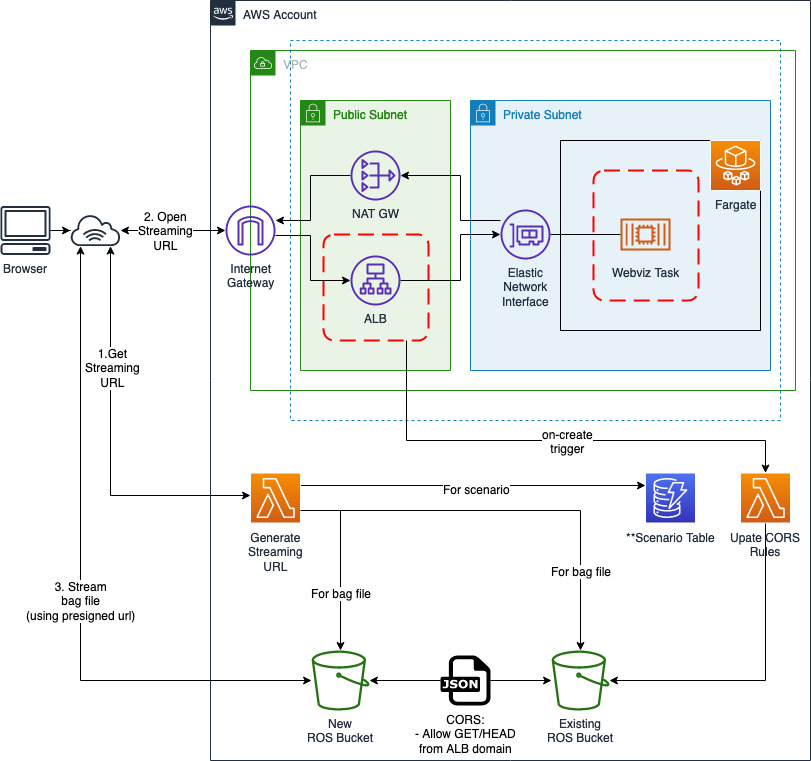

## AWS Autonomous Driving Datalake: Rosbag visualization using Webviz on ECS

Sample application to deploy [Cruise Automation Webviz](https://github.com/cruise-automation/webviz) into AWS and use it to visualize rosbag files.

The application CDK code will deploy webviz as a container on fargate with an elastic load balancer. It will also create an s3 bucket- or update an existing bucket -and allow streaming bag files (CORS config). It also deploys a lambda function that can be used to create properly formatted Webviz URLs. 

Once the infrastructure has been deployed, the webviz layout can be configured by importing the `layout.json` file. 
To stream rosbag files from your bucket using presigned urls, you can use the `get_url.py` script. This would create
a presigned url to your file and properly encode it and add it as query parameter to webviz in order for it to be streamed. 

### Disclaimer
This sample application deploys a [docker image](https://hub.docker.com/r/cruise/webviz) not maintained or hosted by AWS and as such no guarantees for its availability, security or correctness is given. 

### Architecture



### Project Structure

```
├── README.md # How to use and basic helper commands
├── cdk.json # Project configuration e.g. target bucket
├── get_url.py # Helper script to generate streaming URLs
├── index.ts # CDK app and stack file
├── lambda
│   ├── generate_url
│   │   └── main.py # Lambda source code for generating streaming URLs
│   └── put_cors
│       └── main.py # Lambda source code for updating S3 CORS rules
├── layout.json # Example layout configuration for Webviz
```

### Prerequisites
- Nodejs

### Bootstrap (run first time)
- `npm install`: Install dependencies
-  Update the region in `cdk.json` to your target AWS REGION.
-  Update the <BUCKET_NAME> you want to use in cdk.json (this needs to be globally unique). 
-  If the bucket already exists, set the `bucketExists` flag to `true`.
INFO:
- If you have deployed the solution for [scene detection](https://github.com/aws-samples/aws-autonomous-driving-data-lake-ros-bag-scene-detection-pipeline) you can modify the values of `scenarioDB` in `cdk.json`, otherwise this can be deleted or ignored. 

### How to use
- `npm run cdk synth`: Synthesizes Cloudformation template
- `npm run cdk deploy`: Deploys stack into your account and region
- copy your rosbag files into the bucket and copy it's object key
- generate a <SIGNED_AND_ENCODED_URL> for your rosbag file e.g. `python get_url.py --key <OBJECT_KEY>`
- open the <SIGNED_AND_ENCODED_URL> in chrome or a webviz compatable browser
- at the top right click import/export layout
- copy the contents from `layout.json` and click apply
- click play and watch your rosbag file being streamed

## Security

See [CONTRIBUTING](CONTRIBUTING.md#security-issue-notifications) for more information.

## License

This library is licensed under the MIT-0 License. See the LICENSE file.

